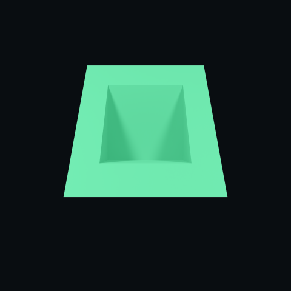
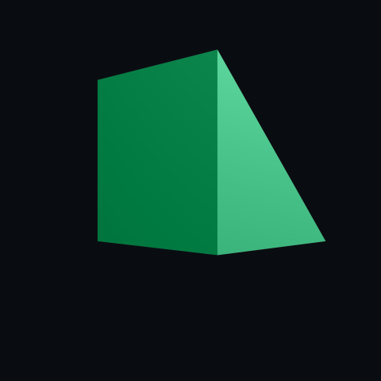
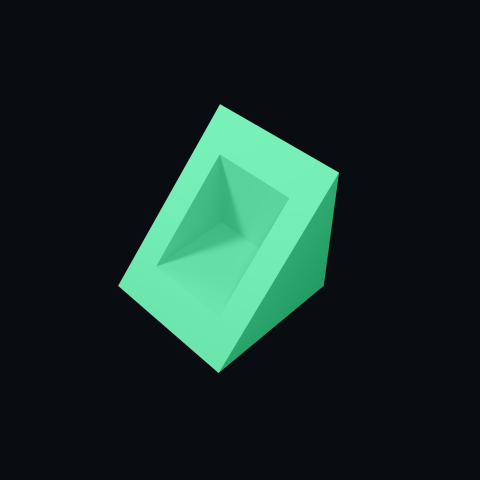
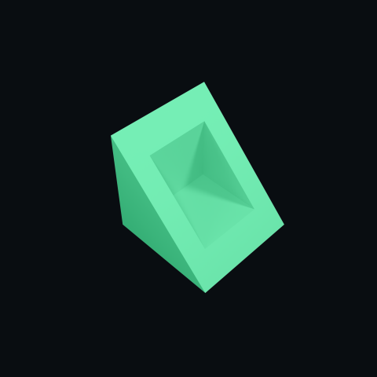

  

    
    <a href="https://learn.microsoft.com/en-us/dotnet/csharp/tour-of-csharp/"><img src="https://img.shields.io/badge/c_sharp-090D11?style=for-the-badge&logo=data:image/svg+xml;base64,PD94bWwgdmVyc2lvbj0iMS4wIiBlbmNvZGluZz0iVVRGLTgiIHN0YW5kYWxvbmU9Im5vIj8+CjwhRE9DVFlQRSBzdmcgUFVCTElDICItLy9XM0MvL0RURCBTVkcgMS4xLy9FTiIgImh0dHA6Ly93d3cudzMub3JnL0dyYXBoaWNzL1NWRy8xLjEvRFREL3N2ZzExLmR0ZCI+Cjxzdmcgd2lkdGg9IjEwMCUiIGhlaWdodD0iMTAwJSIgdmlld0JveD0iMCAwIDE0MjMgMTYwMCIgdmVyc2lvbj0iMS4xIiB4bWxucz0iaHR0cDovL3d3dy53My5vcmcvMjAwMC9zdmciIHhtbG5zOnhsaW5rPSJodHRwOi8vd3d3LnczLm9yZy8xOTk5L3hsaW5rIiB4bWw6c3BhY2U9InByZXNlcnZlIiB4bWxuczpzZXJpZj0iaHR0cDovL3d3dy5zZXJpZi5jb20vIiBzdHlsZT0iZmlsbC1ydWxlOmV2ZW5vZGQ7Y2xpcC1ydWxlOmV2ZW5vZGQ7c3Ryb2tlLWxpbmVqb2luOnJvdW5kO3N0cm9rZS1taXRlcmxpbWl0OjI7Ij4KICAgIDxnIHRyYW5zZm9ybT0ibWF0cml4KDUuNTU1NTYsMCwwLDUuNTU1NTYsMCwwKSI+CiAgICAgICAgPGc+CiAgICAgICAgICAgIDxwYXRoIGQ9Ik0yNTUuNTY5LDg0LjQ1MkMyNTUuNTY3LDc5LjYyMiAyNTQuNTM0LDc1LjM1NCAyNTIuNDQ1LDcxLjY5MUMyNTAuMzkzLDY4LjA4OSAyNDcuMzIsNjUuMDcgMjQzLjE5OCw2Mi42ODNDMjA5LjE3Myw0My4wNjQgMTc1LjExNSwyMy41MDUgMTQxLjEwMSwzLjg2NkMxMzEuOTMxLC0xLjQyOCAxMjMuMDQsLTEuMjM1IDExMy45MzgsNC4xMzVDMTAwLjM5NSwxMi4xMjIgMzIuNTksNTAuOTY5IDEyLjM4NSw2Mi42NzJDNC4wNjQsNjcuNDg5IDAuMDE1LDc0Ljg2MSAwLjAxMyw4NC40NDNDMCwxMjMuODk4IDAuMDEzLDE2My4zNTIgMCwyMDIuODA4QzAsMjA3LjUzMiAwLjk5MSwyMTEuNzE3IDIuOTg4LDIxNS4zMjVDNS4wNDEsMjE5LjAzNiA4LjE1NywyMjIuMTM4IDEyLjM3NCwyMjQuNTc5QzMyLjU4LDIzNi4yODIgMTAwLjM5NCwyNzUuMTI2IDExMy45MzQsMjgzLjExNUMxMjMuMDQsMjg4LjQ4OCAxMzEuOTMxLDI4OC42OCAxNDEuMTA0LDI4My4zODRDMTc1LjExOSwyNjMuNzQ0IDIwOS4xNzksMjQ0LjE4NiAyNDMuMjA5LDIyNC41NjdDMjQ3LjQyNiwyMjIuMTI3IDI1MC41NDIsMjE5LjAyMyAyNTIuNTk1LDIxNS4zMTVDMjU0LjU4OSwyMTEuNzA3IDI1NS41ODIsMjA3LjUyMiAyNTUuNTgyLDIwMi43OTdDMjU1LjU4MiwyMDIuNzk3IDI1NS41ODIsMTIzLjkwOCAyNTUuNTY5LDg0LjQ1MiIgc3R5bGU9ImZpbGw6cmdiKDU2LDE3NywxMjApO2ZpbGwtcnVsZTpub256ZXJvOyIvPgogICAgICAgICAgICA8cGF0aCBkPSJNMTI4LjE4MiwxNDMuMjQxTDIuOTg4LDIxNS4zMjVDNS4wNDEsMjE5LjAzNiA4LjE1NywyMjIuMTM4IDEyLjM3NCwyMjQuNTc5QzMyLjU4LDIzNi4yODIgMTAwLjM5NCwyNzUuMTI2IDExMy45MzQsMjgzLjExNUMxMjMuMDQsMjg4LjQ4OCAxMzEuOTMxLDI4OC42OCAxNDEuMTA0LDI4My4zODRDMTc1LjExOSwyNjMuNzQ0IDIwOS4xNzksMjQ0LjE4NiAyNDMuMjA5LDIyNC41NjdDMjQ3LjQyNiwyMjIuMTI3IDI1MC41NDIsMjE5LjAyMyAyNTIuNTk1LDIxNS4zMTVMMTI4LjE4MiwxNDMuMjQxIiBzdHlsZT0iZmlsbDpyZ2IoNTYsMTc3LDEyMCk7ZmlsbC1ydWxlOm5vbnplcm87Ii8+CiAgICAgICAgICAgIDxwYXRoIGQ9Ik0yNTUuNTY5LDg0LjQ1MkMyNTUuNTY3LDc5LjYyMiAyNTQuNTM0LDc1LjM1NCAyNTIuNDQ1LDcxLjY5MUwxMjguMTgyLDE0My4yNDFMMjUyLjU5NSwyMTUuMzE1QzI1NC41ODksMjExLjcwNyAyNTUuNTgsMjA3LjUyMiAyNTUuNTgyLDIwMi43OTdDMjU1LjU4MiwyMDIuNzk3IDI1NS41ODIsMTIzLjkwOCAyNTUuNTY5LDg0LjQ1MiIgc3R5bGU9ImZpbGw6cmdiKDU2LDE3NywxMjApO2ZpbGwtcnVsZTpub256ZXJvOyIvPgogICAgICAgICAgICA8cGF0aCBkPSJNMjAxLjg5MiwxMTYuMjk0TDIwMS44OTIsMTI5Ljc2OEwyMTUuMzY2LDEyOS43NjhMMjE1LjM2NiwxMTYuMjk0TDIyMi4xMDMsMTE2LjI5NEwyMjIuMTAzLDEyOS43NjhMMjM1LjU3NywxMjkuNzY4TDIzNS41NzcsMTM2LjUwNUwyMjIuMTAzLDEzNi41MDVMMjIyLjEwMywxNDkuOTc4TDIzNS41NzcsMTQ5Ljk3OEwyMzUuNTc3LDE1Ni43MTVMMjIyLjEwMywxNTYuNzE1TDIyMi4xMDMsMTcwLjE4OUwyMTUuMzY2LDE3MC4xODlMMjE1LjM2NiwxNTYuNzE1TDIwMS44OTIsMTU2LjcxNUwyMDEuODkyLDE3MC4xODlMMTk1LjE1NSwxNzAuMTg5TDE5NS4xNTUsMTU2LjcxNUwxODEuNjgyLDE1Ni43MTVMMTgxLjY4MiwxNDkuOTc4TDE5NS4xNTUsMTQ5Ljk3OEwxOTUuMTU1LDEzNi41MDVMMTgxLjY4MiwxMzYuNTA1TDE4MS42ODIsMTI5Ljc2OEwxOTUuMTU1LDEyOS43NjhMMTk1LjE1NSwxMTYuMjk0TDIwMS44OTIsMTE2LjI5NFpNMjE1LjM2NiwxMzYuNTA1TDIwMS44OTIsMTM2LjUwNUwyMDEuODkyLDE0OS45NzhMMjE1LjM2NiwxNDkuOTc4TDIxNS4zNjYsMTM2LjUwNVoiIHN0eWxlPSJmaWxsOnJnYigzNCwzNCwzNCk7ZmlsbC1ydWxlOm5vbnplcm87Ii8+CiAgICAgICAgICAgIDxwYXRoIGQ9Ik0xMjguNDU3LDQ4LjYyNkMxNjMuNjAxLDQ4LjYyNiAxOTQuMjg0LDY3LjcxMiAyMTAuNzE5LDk2LjA4MkwyMTAuNTU4LDk1LjgwOUwxNjkuMjEsMTE5LjYxN0MxNjEuMDYzLDEwNS44MjQgMTQ2LjEyOCw5Ni41MTUgMTI4Ljk5Niw5Ni4zMjNMMTI4LjQ1Nyw5Ni4zMkMxMDIuMzMxLDk2LjMyIDgxLjE1MSwxMTcuNSA4MS4xNTEsMTQzLjYyNUM4MS4xNTEsMTUyLjE2OSA4My40MjgsMTYwLjE3OCA4Ny4zOSwxNjcuMDk1Qzk1LjU0NCwxODEuMzMgMTEwLjg3MywxOTAuOTMxIDEyOC40NTcsMTkwLjkzMUMxNDYuMTUsMTkwLjkzMSAxNjEuNTY2LDE4MS4yMDggMTY5LjY3OCwxNjYuODIxTDE2OS40ODEsMTY3LjE2NkwyMTAuNzY4LDE5MS4wODRDMTk0LjUxMywyMTkuMjEzIDE2NC4yNSwyMzguMjQxIDEyOS41MTUsMjM4LjYyTDEyOC40NTcsMjM4LjYyNkM5My4yMDIsMjM4LjYyNiA2Mi40MzIsMjE5LjQyMiA0Ni4wMzgsMTkwLjkwMkMzOC4wMzUsMTc2Ljk3OSAzMy40NTYsMTYwLjgzOCAzMy40NTYsMTQzLjYyNUMzMy40NTYsOTEuMTU5IDc1Ljk4OCw0OC42MjYgMTI4LjQ1Nyw0OC42MjZaIiBzdHlsZT0iZmlsbDpyZ2IoMzQsMzQsMzQpO2ZpbGwtcnVsZTpub256ZXJvOyIvPgogICAgICAgIDwvZz4KICAgIDwvZz4KPC9zdmc+Cg==&logoColor=38b178"></a>
    
    
    

    
    

<h1 align="center">
Orthographic Renderer
</h1>

An tool for rendering orthographic views of 3D models, designed to replace traditional CPU rendering in CAD software. It is optimized for both speed and quality, featuring parallel rendering capabilities and GPU acceleration via OPTIX and CUDA.

  

<h2>
Sample Renders
</h2>

this needs to take available width

<table>
  <tr>
    <td></td>
    <td></td>
    <td></td>
    <td></td>
    <td></td>
  </tr>
  <tr>
    <td></td>
    <td></td>
    <td></td>
    <td></td>
    <td></td>
  </tr>
  <tr>
    <td></td>
    <td></td>
    <td></td>
    <td></td>
    <td></td>
  </tr>
  <tr>
    <td></td>
    <td></td>
    <td></td>
    <td></td>
    <td></td>
  </tr>
  <tr>
    <td></td>
    <td></td>
    <td></td>
    <td></td>
    <td></td>
  </tr>
</table>
