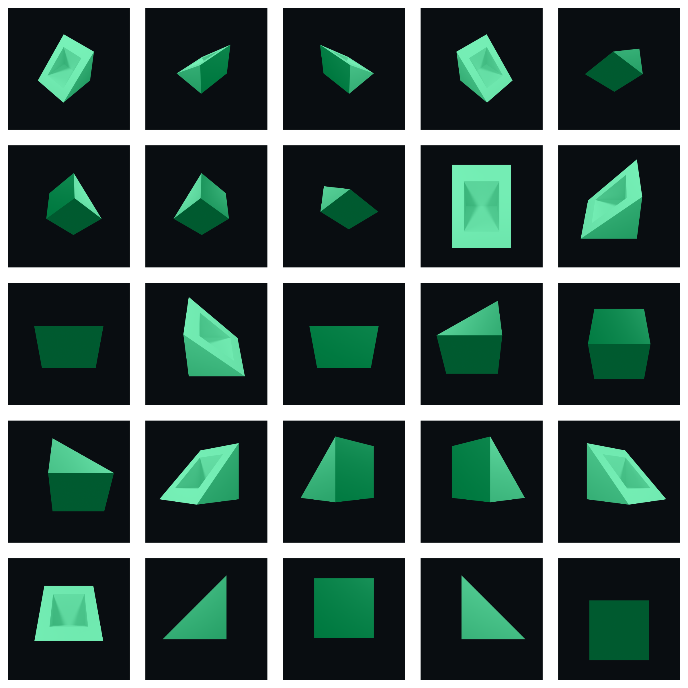

  

    
    
    
    
    

    
    

<h1 align="center">Orthographic Renderer</h1>

A tool for rendering orthographic views of 3D models using hardware accelerated ray tracing. Designed to replace traditional CPU rendering in CAD software, it is optimized for both speed and quality, featuring parallel rendering capabilities and GPU acceleration via OPTIX and CUDA.

<h2>
Gallery
</h2>

  
  
  
  
  
  

<h2>
Installation
</h2>

Download the latest installer from the releases page. The application is available for Windows and Linux with NVIDIA GPU support. MacOS and AMD GPU support is planned for the future. 

<h2>
Requirements
</h2>

Blender is bundled with the application, so you do not need to install it separately. However, you should download and install the latest drivers for your GPU.

<h2>
Usage
</h2>

<h3>
Importing a Model 📂
</h3>

Orthographic Renderer supports .blend, .obj, and .stl files. For .obj and .stl files you must set the unit appropriately,
so that the model is imported with the correct scale.

<h3>
Hardware Capabilities 🖥️
</h3>

The application will scan your system for compatible hardware and display the supported frameworks for each component.

<h3>
Camera and Lighting ☀️
</h3>

You can adjust the camera distance, and lights, and modify their colour, position, power, size, and distance. Additionally, you can change the background colour and view a real-time preview to dial in your settings as needed.

<h3>
Views 📷
</h3>

There are 26 orthographic views to choose from. You can select the views you want to render by clicking on the checkboxes. 

<h3>
Rendering 🚀
</h3>

There are two types of render modes to choose from. Sequential mode renders each view one by one, while parallel mode renders all views at the same time. It is important to note that parallel mode is only faster if you have hardware with enough overhead to run more than one render at a time. If you are reaching the limits of your hardware, you may want to lower the number of threads or use sequential mode. Once your views have been selected and all settings have been adjusted, you can start rendering by clicking the "Render" button. You will be notified when the rendering is complete with both a sound (optional) and a popup message with statistics.  

  

